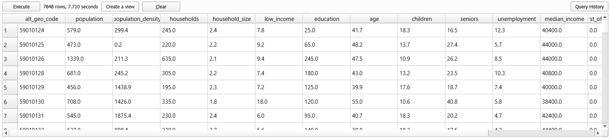

```{r echo=FALSE}
yml_content <- yaml::read_yaml("chapterauthors.yml")
author <- yml_content[["geographically-weighted-regression"]][["author"]]
```

# Lab Title {#geographically-weighted-regression}

Written by

```{r results='asis', echo=FALSE}
cat(author)
```

## Lab Overview {.unnumbered}

In this lab, you will be exploring one of the newer techniques of spatial analysis: geographically weighted regression (GWR). GWR is the spatial extension of aspatial regression analysis and much more. Traditional regression analysis assumes that global statistics adequately describe local relationships that might exist in the data. For example, consider looking at the relationship between housing prices and the floor space, lot size, etc., of houses in the city of Vancouver. While we could develop a 'global' model that adequately describes the relationship between those variables, knowing what you do about housing prices in the city of Vancouver (e.g., that a house of similar dimensions, age, lot size, etc., in the east side of Vancouver will sell for hundreds of thousands of dollars less than an identical house in the west side of Vancouver), the utility of such a model when looking at neighborhood-level housing issues would be very doubtful. Nonetheless, for decades such models, such as hedonic models, have been normalized in real estate research.

Similarly, consider studying the relationship between rates of crime or diseases to environmental conditions, local conditions can be much more important than any global relationship that might be discovered via a traditional aspatial statistical approach. Using polygon or point data, GWR allows us to explore the local relationships amongst a set of variables and examine the results spatially using ArcGIS. It should be noted that in R you can find more sophisticated approaches to GWR than what is provided by ArcGIS.

In this lab, we will explore the relationship between green space and a small set of demographic variables in Vancouver. The variables were collected from [https://censusmapper.ca/#12/49.2560/-123.1178](www.censusmapper.ca). Census Mapper offers services that allow for easier access to certain Statistics Canada data and census variables. (Note: To download data from the website, you will need to register for an account. For this lab, we have already downloaded the relevant data for you.)

Green spaces include parks, community gardens, and urban forests. The City of Vancouver has an ambitious goal to be the World's Greenest City, so "Vancouver residents will enjoy incomparable access to green spaces, including the world's most spectacular urban forest."

To do so, the city's targets are to "Ensure that every person lives within a 5 minute walk of a park, greenway, or other green space by 2020; restore or enhance 25ha of natural areas between 2010 and 2020".

Why is access to green spaces so important? Human wellbeing, including physical and psychological wellbeing increase when residents are exposed to green space and urban forests. In addition, ecosystem services provided from green spaces include improved air quality, urban heat island mitigation, and opportunities for recreation. Yet, green spaces and forests are becoming increasingly fragmented, affecting the size, shape, and spatial arrangement of forest patches, which can adversely affect ecosystem functions and human wellbeing.

In addition, there is unequal access to green spaces across urban landscapes. The distribution of green space is often disproportionately present in affluent communities. So, you will test the hypothesis that there is less green space in marginalized communities. We cannot infer any causal relationships, but we can examine the relationship between the location of green spaces and demographic variables.

Vancouver is the most populous city in British Columbia, Canada with a population of just over 675,000. Vancouver is an ideal study site because of the city's high level of heterogeneity among its demographic and landscape structure. You will be using dissemination areas (DA), the second smallest unit of Canada's census data that is publicly available.

------------------------------------------------------------------------

## Learning Objectives {.unnumbered}

-   Lorem ipsum
-   Lorem ipsum
-   Lorem ipsum

------------------------------------------------------------------------

## Deliverables {#lab5-deliverables .unnumbered}

-   A table with the ordinary least squares and geographically weighted regression results
-   A two-page report outlining your results with at least one map

------------------------------------------------------------------------

## Data {#data .unnumbered}

All data for this lab are accessible via the UBC PostgreSQL server. Instructions for connecting to the server are given in the tasks below. We will be using data from the \`greenequity\` database.

Statistics Canada. 2022. Census Profile. 2021 Census. Statistics Canada Catalogue no. 98-316-X2021001. Ottawa. Released December 15, 2022. <https://www12.statcan.gc.ca/census-recensement/2021/dp-pd/prof/index.cfm?Lang=E>

We are using only a small subset of the national 2021 census data set for British Columbia: "Canada, provinces, territories, census divisions (CDs), census subdivisions (CSDs) and dissemination areas (DAs) - British Columbia only" (Statistics Canada Catalogue no. 98-401-X2021006).

The Statistics Canada 2021 spatial boundary files are maintained separately and available for download from here: <https://www12.statcan.gc.ca/census-recensement/2021/geo/sip-pis/boundary-limites/index2021-eng.cfm?year=21>

The spatial data from Statistics Canada that we will be using:

| Layer Name    | Description         |
|---------------|---------------------|
| lcsd000b21a_e | Census subdivisions |
| lda_000b21a_e | Dissemination areas |

If you are a student at UBC, these data have already been prepared and loaded into the UBC PostgreSQL server, so there is no need to download anything. The links above are only for reference.

Metadata for the 2021 spatial boundary files can be found here: <https://www150.statcan.gc.ca/n1/pub/92-160-g/92-160-g2021002-eng.htm>

The Dictionary for Census of Population 2021 can be found here: <https://www12.statcan.gc.ca/census-recensement/2021/ref/dict/index-eng.cfm>

------------------------------------------------------------------------

## Task 1: Prepare census data {.unnumbered}

Statistics Canada census data are distributed in tables, which are great for working with in a relational database like PostgreSQL. These data can be particularly challenging to work with because they span multiple geographical hierarchies (e.g., national, provincial, municipal, etc.), multiple dates (the Canadian census occurs every 5 years), many demographic dimensions (e.g., population, age, education, language, etc.), and there are an enormous amount of enumerated areas.

The smallest geographic unit that census data are enumerated over are known as Dissemination Areas (DA). Statistics Canada gives the definition:

> A dissemination area (DA) is a small, relatively stable geographic unit composed of one or more adjacent dissemination blocks with an average population of 400 to 700 persons based on data from the previous Census of Population Program. It is the smallest standard geographic area for which all census data are disseminated. DAs cover all the territory of Canada.

As of the 2021 Canadian census, there are 57,936 unique Dissemination Areas. Each Dissemination Area is described by 2,631 unique characteristics (total population, age, education, language, etc.). That is a whopping 152 million values for describing Canadians! Lucky for us, we will be working with DAs for Vancouver, British Columbia and only a handful of characteristics.

To make this a realistic exercise, we will be working with the raw Statistics Canada table for British Columbia and the national set of dissemination areas, which have been loaded into the UBC PostgreSQL server. These data are also publicly available if you want to replicate the lab on your own (see [Data](#data) section)

**Step 1:** Open QGIS and connect to the `greenequity` database on the UBC PostgreSQL server using the credential that you have been provided. You might be tempted to add the layers **lda_000b21a_e** and **lcsd000b21a_e** to your map. You can do this, but it will probably slow down your computer as you are requesting all 57,936 dissemination areas and 5,161 census subdivisions from the server, respectively. Instead, we will use some PostGIS magic to filter on the server side before making our request for only the Vancouver DAs to our QGIS client.

Unfortunately, the only geographical identification attribute that Statistics Canada distributes with the dissemination areas layer (**lda_000b21a_e**) is "PRUID", which limits us to querying on provinces and territories [based on codes](https://www12.statcan.gc.ca/census-recensement/2021/geo/ref/domain-domaine/index2021-eng.cfm?lang=e&id=PRUID). Cities, like Vancouver, are available in the census subdivisions layer (**lcsd000b21a_e**), so we will need to do a simple overlay to extract only the dissemination areas in Vancouver.

**Step 2:** Open the Database Manager in QGIS ("Database" \> "DB Manager"). Expand the "PostGIS" source provider on the left, expand the "greenequity" database, and finally expand the "public" schema. Click the button at the top to open a new SQL window. In the empty query space, paste the following SQL query:

``` sql
WITH vancouver AS (
    SELECT wkb_geometry FROM lcsd000b21a_e  
    WHERE CSDNAME = 'Vancouver'
)
SELECT lda_000b21a_e.wkb_geometry
FROM vancouver, lda_000b21a_e
WHERE ST_Within(lda_000b21a_e.wkb_geometry, vancouver.wkb_geometry);
```

This syntax should look familiar if you have completed the previous PostGIS labs. A common table expression (CTE) is used to get the census subdivision representing Vancouver, which is then used to get all the dissemination areas that represent Vancouver. We are introducing a new [PostGIS function](https://postgis.net/docs/ST_Within.html) here called `ST_Within`, which simply tests if the geometry of `lda_000b21a_e` are completely within the geometry of `vancouver`. Click the "Execute" button and inspect the output on screen. You should see 1,016 rows returned. But in order to join the census data, which are stored separately, we will also need the DAUID and DGUID fields in this output layer.

**Step 3:** Modify the query above so that you return a table that holds the DAUID, DGUID, and the wkb_geometry fields. Once successful, your table should look like the image below.

```{r 05-qgis-query, out.width= "75%", echo = FALSE}
    knitr::include_graphics("images/05-qgis-query.png")
```

If you want, you can toggle on "Load as a new layer", set "Column(s) with unique values" to "dauid", set "Geometry column" to "wkb_geometry", and click the "Load" button to temporarily load the query into your map to inspect it. This is not going to be our final layer yet, as we still need to join the appropriate census data to the geographic features.

**Step 4:** Open the psql shell and connect to the `greenequity` database on the UBC PostgreSQL server using the credential that you have been provided. Use the following query to return the first 20 rows of the "census2021" table:

``` sql
SELECT * FROM census2021 LIMIT 20;
```

Do you notice that the data are oddly formatted? Notably, the first eight columns have repeating information, including the primary key "DGUID"! This data organization is known as **long-format** and is useful when storing highly-dimensional data, and the census data you are working with have 2,631 dimensions!

Think of long-format as a list. Each row represents a new entry that holds a value or several values for a given observation-dimension pair. The advantage here is that if we do not have a value for a particular dimension for a particular observation, then we do not need to record anything, the row does not exist. Another advantage is that most relational database management systems have a limit on the number of columns that can be stored in a single table. For PostgreSQL, that limit is 1,600 columns compared to 255 for Microsoft Access databases, 1,024 for Microsoft SQL Server databases, and 1,000 for Oracle databases, just to name a few. However, there is practically no upper limit to the number of rows that can be stored in any of these databases.

This is a bit odd, because for most data analysis we are accustomed to seeing **wide-format** data where each row represents a unique feature that is described by many dimensions across the columns.

**Step 5:** Use the following query to return a table of population in the first 10 DGUIDs:

``` sql
SELECT alt_geo_code, MAX(c1_count_total) FILTER (WHERE characteristic_id = 1) AS population 
FROM census2021 
GROUP BY alt_geo_code 
LIMIT 10;
```

In this query, we are aggregating and grouping the data values back into our customary wide-format. We use the `MAX` aggregation function, though any other aggregation function would work since for any given dimension-observation there is only one value, so nearly any aggregation function applied to a single value would return that value (e.g., `max`, `min`, `avg`, `sum`). The reason for using the aggregation function at all is because the `FILTER` keyword will only apply aggregation functions to the predicate that follows `(WHERE characteristic_id = 1)`. Finally, `GROUP BY alt_geo_code` ensures that the output table lists the populations for each `alt_geo_code`.

### A word about alt_geo_code

The `alt_geo_code` is an identifier for every unique geographic division for census data in Canada. Some codes are shorter or longer than others, and this signifies the level in the geographic division hierarchy. For example, `alt_geo_code = 1` is the code for the entire country of Canada. So the first row you see in the output table from the query you ran above is the total population `characteristic_id = 1` of Canada in 2021. Since the `alt_geo_code` is numeric, it is more flexible to query with than the DGUID, which is alphanumerical. `alt_geo_code = 59` is the code for the province of British Columbia. Remember that the data we are working with is only a subset of the national census representing the province of British Columbia, so there are no other provincial codes represented here. The code structure is pretty easy to follow from here. Every other geographic subdivision in British Columbia will begin with 59 and depending on the level of the hierarchy, will contain a different number of digits:

-   `alt_geo_code = 59` represents British Columbia in the **Provinces and Territories Unique Identifier (PRUID)**

-   `alt_geo_code = 5901` represents the first `01` **Census Division (CD)**

-   `alt_geo_code = 5901003` represents the third `003` **Census Subdivision (CSD)** in the first CD

-   `alt_geo_code = 59010100` represents the 100th `0100` **Dissemination Area (DA)** in the third CSD, in the first CD

Codes with 8 digits are therefore **Dissemination Area Unique Identifiers (DAUID)**, which you should recognize are the values we need to use to join the census data to the actual dissemination area polygons that we just extracted in QGIS.

**Step 6:** We can modify our earlier query slightly to ensure we are only dealing with DAs:

``` sql
SELECT alt_geo_code, MAX(c1_count_total) FILTER (WHERE characteristic_id = 1) AS population 
FROM census2021 
WHERE geo_level = 'Dissemination area' 
GROUP BY alt_geo_code 
LIMIT 10;
```

**Step 7:** Now modify the query above and add all of the characteristics in the table below. Some IDs are given in the table below. For the remainder, you are expected to find the correct ID. You may need to refer to the [readme file](./data/98-401-X2021006_English_meta.txt) that is distributed with the 98-401-X2021006 table in order to identify the correct characteristic_id, which is listed under "Definitions / Footnotes", "Characteristic (2631)", and "Member". The number appearing to the far left of the readme file corresponds to the `characteristic_id` in the database.

| Characteristic_ID | Characteristic                                                                   | Units    | Name                    |
|------------------|--------------------|------------------|------------------|
|                   | Population, 2021                                                                 | Persons  | Population              |
|                   | Population density per square kilometre                                          | Persons  | Population density      |
|                   | Total - Private households by household size - 100% data                         | Families | Households              |
|                   | Average household size                                                           | Persons  | Household size          |
| 345               | Prevalence of low income based on the Low-income measure, after tax (LIM-AT) (%) | \%       | Low income              |
| 2008              | Bachelor's degree or higher                                                      | Persons  | Education               |
|                   | Average age of the population                                                    | Years    | Age                     |
| 35                | 0 to 14 years                                                                    | \%       | Children                |
| 37                | 65 years and over                                                                | \%       | Seniors                 |
|                   | Unemployment rate                                                                | \%       | Unemployment rate       |
| 113               | Median total income in 2020 among recipients (\$)                                | \$       | Median income           |
| 392               | First official language spoken is neither English nor French                     | Persons  | First official language |
| 398               | Mother tongue is a non-official language                                         | Persons  | Non-official language   |
| 1536              | Immigrants arriving in 2016-2021                                                 | Persons  | Immigrants              |

Your output table should look like the image below:

```{r 05-qgis-query-characteristics, out.width= "75%", echo = FALSE}
    
```

**Step 8:** Finally, we are going to put everything together into a single SQL statement that will query, intersect, aggregate, group, and join the spatial data with the tabular data. Save your SQL query in QGIS Database Manager or copy it and paste it somewhere, then clear the SQL query area and paste the following statement:

``` sql
WITH 

-- Select the alt_geo_code and characteristics we want, aggregate and group them to convert to wide-format

characteristics AS (
  -- Insert your modified query from Step 7 here
),

-- Select the polygon geometry representing Vancouver from the Census Subdivisions (CSD)

vancouver AS (
  SELECT wkb_geometry FROM lcsd000b21a_e WHERE CSDNAME = 'Vancouver'
),

-- Select the Dissemination Areas (DA) that are within the Vancouver CSD

vancouver_da AS (
  SELECT lda_000b21a_e.DAUID, lda_000b21a_e.wkb_geometry
  FROM vancouver, lda_000b21a_e
  WHERE ST_Within(lda_000b21a_e.wkb_geometry, vancouver.wkb_geometry)
)

-- Perform the join of all the characteristics and the Vancouver DA geometries based on the DAUID

SELECT
  characteristics.alt_geo_code,
  characteristics.population,
  characteristics.population_density,
  characteristics.households,
  characteristics.household_size,
  characteristics.low_income,
  characteristics.education,
  characteristics.age,
  characteristics.children,
  characteristics.seniors,
  characteristics.unemployment,
  characteristics.median_income,
  characteristics.first_official_language,
  characteristics.non_official_language,
  characteristics.immigrants,
  vancouver_da.wkb_geometry
FROM
  characteristics
JOIN
  vancouver_da ON characteristics.alt_geo_code::integer = vancouver_da.DAUID::integer;
```

Be sure to add your modified statement from Step 7 where it is indicated. Then, the statement above should produce the final table we are looking for: a layer of dissemination areas for Vancouver that contain the values for the 14 characteristics we are interested in.

```{r 05-qgis-final-query-load-layer, out.width= "75%", echo = FALSE}
    knitr::include_graphics("images/05-qgis-final-query-load-layer.png")
```

**Step 8:** When you are satisfied, export the layer and save it in your project folder. You may also want to save your SQL statement somewhere, too. You can use it later to recover all of your work from this task at any time from the PostgreSQL server. In QGIS, you can now play around with symbolizing the different characteristics. The image below shows population density $\frac{persons}{km^2}$ of Vancouver dissemination areas in 2021 (projected coordinate system is Lambert Conformal Conic).

```{r 05-qgis-population-density-vancouver-2021, out.width= "75%", echo = FALSE}
    knitr::include_graphics("images/05-qgis-population-density-vancouver-2021.png")
```

Note that you cannot perform this last step of joining

------------------------------------------------------------------------

## Task 2: Lorem ipsum {.unnumbered}

Lorem ipsum

**Step 1:** Lorem ipsum.

**Step 2:** Lorem ipsum.

**Step 3:** Lorem ipsum.

**HINT: Lorem ipsum.**

##### Q3. LOREM IPSUM? {.unnumbered}

##### Q4. LOREM IPSUM? {.unnumbered}

------------------------------------------------------------------------

## Summary {.unnumbered}

Here

Return to the [**Deliverables**](#lab5-deliverables) section to check off everything you need to submit for credit in the course management system.
